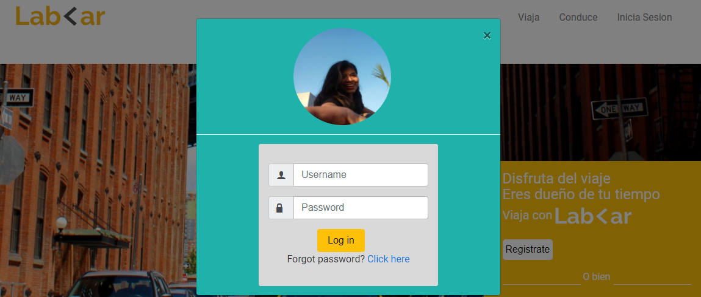
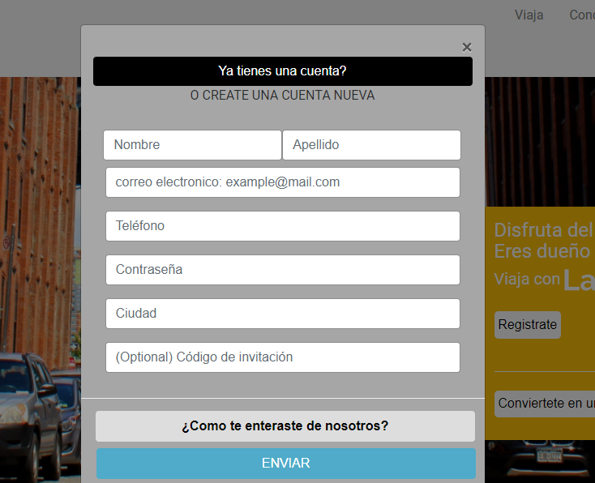
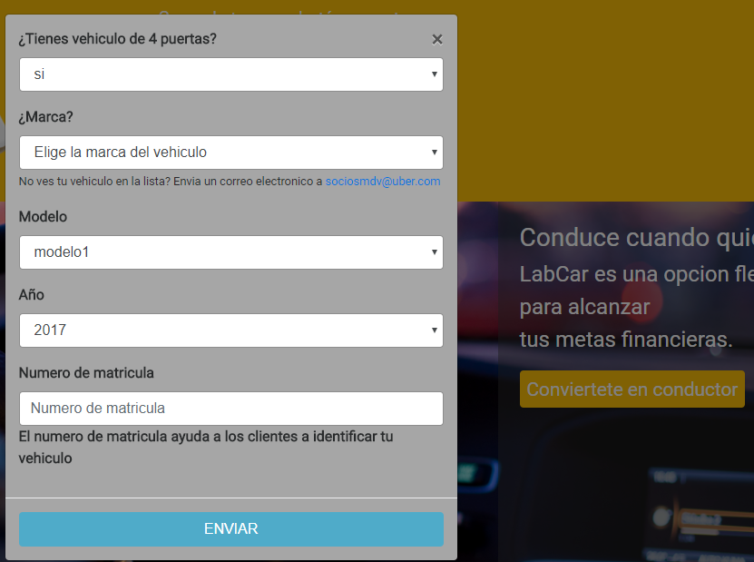
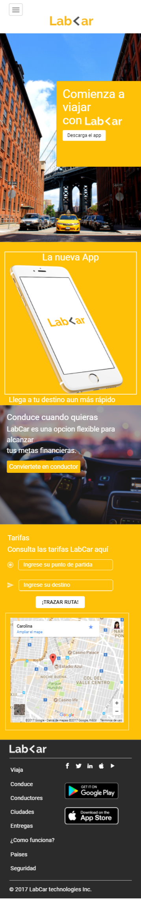

## RETO DE CODIGO LAB-CAR
Track: Common Core.  
Curso: No reinventes la rueda.  
Unidad: La web desde un móvil.

### Objetivo
En el siguiente trabajo se realizo una web responsive con la tecnica Móvile First la cual se adapta a diferentes vistas.

**Incluye modales extra en la version web**
- Modal de Inicia Sesión.  

- Modal de Regístrate.

- Y modal de Conviertete en conductor.

### Herramientas
Se utilizó:

- CSS (Grid System & @Media Queries)  
- HTML
- FRAMEWORK BOOTSTRAP

### Producto Final
**FIRST MOBILE (adaptativo)**  
  

### Participantes:  
- Paola Huaman.  
- Alejandra Hoces.
